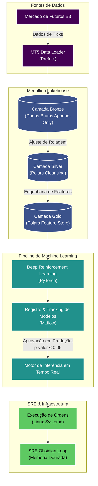

# Motor de Trading Quantitativo de Nível Institucional (Showcase Arquitetural)

Bem-vindo ao *showcase* arquitetural da minha plataforma proprietária de **Trading Quantitativo de Alta Frequência (HFT) e MLOps**.

Devido à natureza confidencial das estratégias de geração de *Alpha* e dos sinais proprietários, o código de execução e estratégias em produção é mantido em repositórios privados. Este repositório público serve como uma **demonstração técnica detalhada** de Engenharia de Dados, pipelines de Machine Learning e práticas de *Site Reliability Engineering* (SRE) utilizadas na construção da plataforma.

---

## Arquitetura do Sistema

O motor é construído sobre uma **Arquitetura Medallion em Lakehouse**, otimizando a ingestão de dados brutos de alta frequência (*ticks* e *candles*), a limpeza estatística e a inferência de modelos em tempo real.

---

## Tecnologias Principais

- **Engenharia de Dados:** Polars (para manipulação ultrarrápida de dataframes sem estouro de memória), Arquitetura Medallion em Lakehouse.
- **Orquestração:** Prefect (orquestração moderna e dinâmica de fluxo de dados, substituindo o Airflow legado).
- **Machine Learning:** *Deep Reinforcement Learning* (DRL) para dimensionamento dinâmico de posição (Fator de Kelly com escala por Incerteza Epistêmica e Aleatória).
- **Gerenciamento de Pacotes:** `uv` para resolução de dependências de altíssima performance.
- **Infraestrutura:** Ajustes refinados de kernel Linux e Systemd (controle estrito de timeouts), ambiente otimizado no Arch/Manjaro com aceleração por GPU NVIDIA RTX 5060 Ti e processador AMD Ryzen 9 9900X.

---

## Destaque Matemático: Emenda de Contratos Futuros & Rolagem (*Splicing*)

Um dos maiores desafios na Engenharia Quantitativa é lidar com **contratos futuros contínuos**. Quando ocorre a transição de um contrato prestes a vencer para o contrato do período subsequente (*rolagem*), surgem *gaps* de preço artificiais devido à taxa de juros embutida (*cost of carry*).

Historicamente, o mercado utilizou o **Método Clássico de Ajuste Retrógrado de Diferenças** (*Panama Method / Backward Difference*):

$$ P_{\text{clássico}}(t) = P_{\text{bruto}}(t) - \sum_{i=t}^{T} \Delta \text{Gap}_i $$

---

### Justificativa de Migração (Estudos PhD Recentes)

Estudos de ponta liderados pelo **Prof. Marcos López de Prado (Cornell / Oxford)** em [*Advances in Financial Machine Learning (2018)*](https://quantresearch.org/) e papers de **Baradel et al.** em [*Journal of Financial Econometrics (2023)*](https://arxiv.org/abs/2202.04944) demonstraram que os métodos clássicos de ajuste por diferença (*Panama Method*) possuem três falhas graves para Machine Learning moderno:

1. **Preços Históricos Negativos:** Subtrair diferenças acumuladas constantes em mercados com alto *Contango* pode fazer preços de anos atrás ficarem negativos (como no WTI em 2020).
2. **Distorção de Retornos Relativos:** A diferença fixa altera a base do denominador no cálculo do retorno percentual:
   $$r_t = \frac{P_t - P_{t-1}}{P_{t-1}}$$
3. **Destruição da Memória Histórica (*Over-differencing*):** A diferenciação inteira ($d=1$) apaga a memória de longo prazo usada por redes neurais (LSTMs, Transformers, DeepLOB).

#### Soluções PhD Implementadas na Plataforma:

1. **Diferenciação Fracionária com Preservação de Memória ($d^*$) — [López de Prado (2018, 2020)](https://doi.org/10.1017/9781108883658):**
   $$(1 - B)^d = \sum_{k=0}^{\infty} (-1)^k \binom{d}{k} B^k = 1 - dB + \frac{d(d-1)}{2!} B^2 - \dots$$
   Atinge a estacionariedade exigida por testes estatísticos (ADF) mantendo a memória máxima dos preços para redes neurais.

2. **Sintetização Perpétua Ponderada por Liquidez — [Baradel et al. (2023)](https://arxiv.org/abs/2202.04944):**
   $$P_{\text{perpétuo}}(t) = w(t) \cdot F_A(t) + (1 - w(t)) \cdot F_B(t)$$
   Transiciona suavemente a liquidez durante a janela de rolagem sem gerar descontinuidades discretas.

---

## Sobre o Autor

Sou estudante de Ciência de Dados e Analytics na **USP (Universidade de São Paulo)**, com profunda paixão por Finanças Quantitativas, MLOps e Engenharia de Dados. Meu trabalho é focado na construção de sistemas de alta disponibilidade que unem modelos matemáticos complexos à execução de baixa latência no mercado financeiro.

*Sinta-se à vontade para entrar em contato para discutir Engenharia de Dados, MLOps ou Finanças Quantitativas!*

---

## Documentação Técnica
- [Mecânica dos Futuros da B3 e o Problema da Rolagem](docs/domain_knowledge/futures_mechanics.md) - Uma explicação aprofundada das anomalias matemáticas causadas pela rolagem dos contratos de WIN$ e WDO$, com fundamentação acadêmica PhD, links diretos para artigos/DOIs e referências bibliográficas.

---

## Palavras-Chave & Hashtags (Quant Finance & MLOps SEO)

`#QuantFinance` `#MLOps` `#QuantitativeTrading` `#HighFrequencyTrading` `#HFT` `#Lakehouse` `#DeepReinforcementLearning` `#Polars` `#PyTorch` `#B3Futures` `#SystematicTrading` `#AlphaGeneration`
