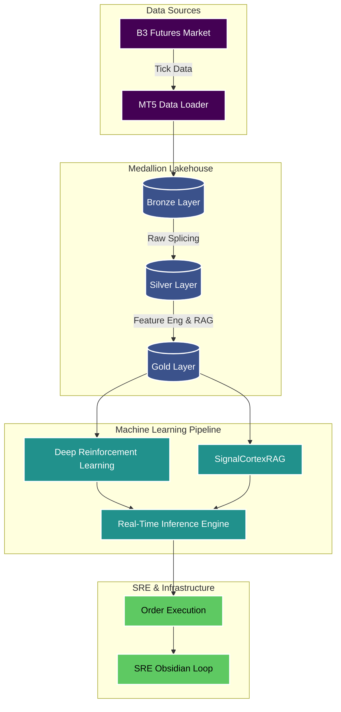

# Institutional-Grade MLOps Trading Engine (Architecture Showcase)

Welcome to the architectural showcase of my proprietary Quantitative Trading Engine. 

Due to the sensitive nature of the Alpha-generating strategies and proprietary signals, the source code is kept in a private repository (`britis-investing`). This public repository serves as a **technical showcase** of the data engineering, machine learning pipelines, and Site Reliability Engineering (SRE) practices used to build the platform.

---

## System Architecture

The engine is built on a **Lakehouse Medallion Architecture**, optimizing high-frequency tick data ingestion, cleaning, and model serving.

## Core Technologies
- **Data Engineering:** Polars (for ultra-fast dataframe manipulation), Lakehouse architecture.
- **Orchestration:** Prefect (for modern, dynamic dataflow orchestration instead of legacy Airflow).
- **Machine Learning:** Deep Reinforcement Learning (DRL) for dynamic position sizing, Retrieval-Augmented Generation (RAG) for semantic market analysis.
- **Package Management:** `uv` for high-performance dependency resolution.
- **Infrastructure:** Systemd tunings (timeout control), strict Linux environments (Manjaro).

## Mathematical Highlight: Futures Splicing & Rollovers

One of the biggest challenges in Quant Engineering is dealing with continuous futures contracts. When rolling over from an expiring contract to a new one, artificial price gaps occur, destroying ML model training.

To solve this, the **Silver Layer** implements a mathematically robust **Backward Difference Splicing**:

$$ P_{adjusted}(t) = P_{raw}(t) - \sum_{i=t}^{T} \Delta Gap_i $$

*Where:*
- $P_{raw}$ is the raw price from the Bronze layer.
- $\Delta Gap$ is the exact price difference recorded at the rollover boundary.
- The cumulative backward shift ensures that historical volatilities and returns are preserved, preventing the DRL model from learning fake "jumps".

## About the Author

I am a Data Science and Analytics student at USP (Universidade de São Paulo) with a deep passion for quantitative finance, MLOps, and Data Engineering. My work focuses on building robust, highly available systems that bridge the gap between complex mathematical models and real-time execution.

*Feel free to reach out to discuss Data Engineering, MLOps, or Quant Finance!*

## Documentation
- [B3 Futures Mechanics & The Rollover Problem](docs/domain_knowledge/futures_mechanics.md) - A deep dive into the mathematical anomalies caused by B3 contract rollovers and how our MLOps pipeline solves them.
